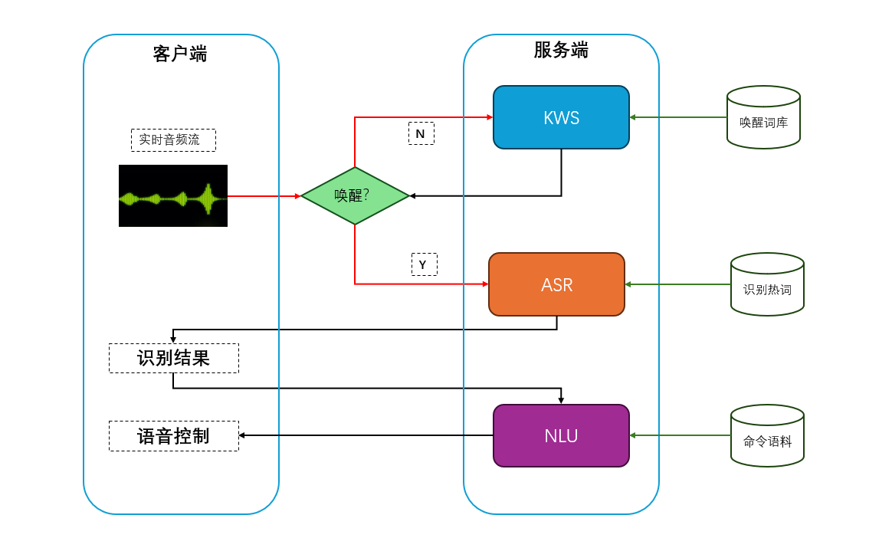
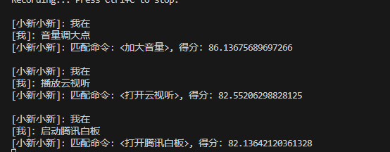

# Funsound 语音助手 

## 概述
本语音助手实现了从关键词唤醒 (KWS) 到语音识别 (ASR) 再到自然语言理解 (NLU) 的完整流程。该系统可以通过监听用户的音频输入，检测指定的关键词，并将用户的语音转换为文本，最后与预设的命令进行匹配，执行相应的操作（具体实现请参考main.py），为你的设备配置远程语音助手。

## 流程步骤

### 1. 初始化配置
在启动时，语音助手会加载以下配置：
- **KWS关键词列表** (`words_kws.txt`)：用于检测唤醒词，如 "小新小新" 或 "小爱同学"。
- **ASR热词及其权重** (`words_asr.txt`)：用于优化语音识别的热词列表及其权重，如 "阿里巴巴 20"。
- **NLU命令匹配句子** (`words_nlu.txt`)：预定义的命令句子列表，如 "打开灯"、"关闭灯" 等。

### 2. 建立WebSocket连接
系统通过以下两个WebSocket连接与KWS和ASR服务器进行交互：
- **KWS WebSocket连接**：用于传输音频流并接收关键词检测结果。
- **ASR WebSocket连接**：用于传输音频流并接收语音识别结果。

### 3. 关键词唤醒 (KWS)
当系统启动后，它首先处于关键词唤醒 (KWS) 模式。系统从麦克风获取音频数据，并将这些数据通过WebSocket发送到KWS服务器。服务器实时分析音频流，如果检测到预定义的唤醒词，系统将从KWS模式切换到ASR模式，并准备进行语音识别。

### 4. 语音识别 (ASR)
在ASR模式下，系统继续从麦克风获取音频数据，并将其发送到ASR服务器。ASR服务器会将音频数据转换为文本，并实时返回识别结果。识别结果分为两种：
- **在线识别结果**：实时返回的识别文本片段。
- **离线识别结果**：最终的完整句子识别结果。

### 5. 自然语言理解 (NLU)
当ASR返回完整的离线识别结果后，系统会将该文本发送到NLU服务器进行分析。NLU服务器会将该文本与预定义的命令进行匹配，并返回最匹配的命令及其得分。

### 6. 执行命令
系统根据NLU的匹配结果，输出相应的命令和匹配得分。如果匹配的命令足够明确，系统可以执行相应的操作，如控制设备的开关等。

### 7. 循环检测
处理完成后，系统重新进入KWS模式，等待下一个唤醒词的检测，整个流程循环进行。

结果展示：

远程服务搭建联系作者邮箱：605686962@qq.com
